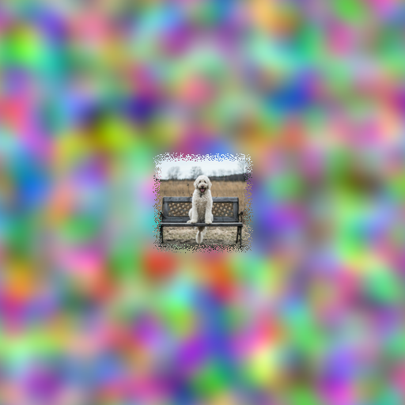
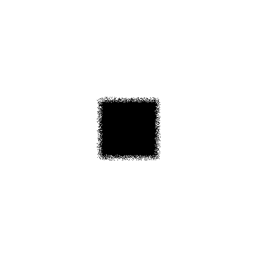
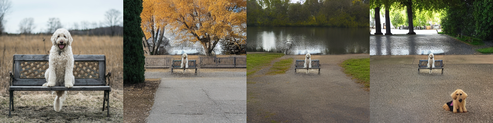

# What this is
Downscale image, add noise on the edge and add perlin noise in the background.

Base image should be 512x512 px. 

|Base Image|Input Image|Mask Image|
|---|---|---|
| |  | |


Results after inpainting:




# Installation
Create and activate a python environnement, then:
```bash
git clone https://github.com/PhilSad/stable-diffusion-outpainting
pip install -r requirements.txt
```

## Script Usage:

```bash
python ./downscale_and_noise.py --input_image ./images/base.png --output_init ./images/init.png --output_mask ./images/mask.png
```

## Module Usage:

```python
from downscale_and_noise import get_init_mask_image

with open('./images/base.png', 'rb') as f:
    base_image = Image.open(f)
    base_image.load()

init_image, mask_image = get_init_mask_image(base_image)
```

# Uncrop / Outpaint image

```python
import PIL
import requests
import torch
from io import BytesIO
from PIL import Image
from diffusers import StableDiffusionInpaintPipeline
import numpy as np

prompt = "A dog sitting on a park bench"

init_image_arr = np.array(init_image)
mask_image_arr = np.array(mask_image)
pipe = StableDiffusionInpaintPipeline.from_pretrained(
    "runwayml/stable-diffusion-inpainting"
).to('cuda')
pipe.enable_attention_slicing()

outpainted_image = pipe(prompt=prompt, image=init_image_arr, mask_image=mask_image_arr).images[0]
```
